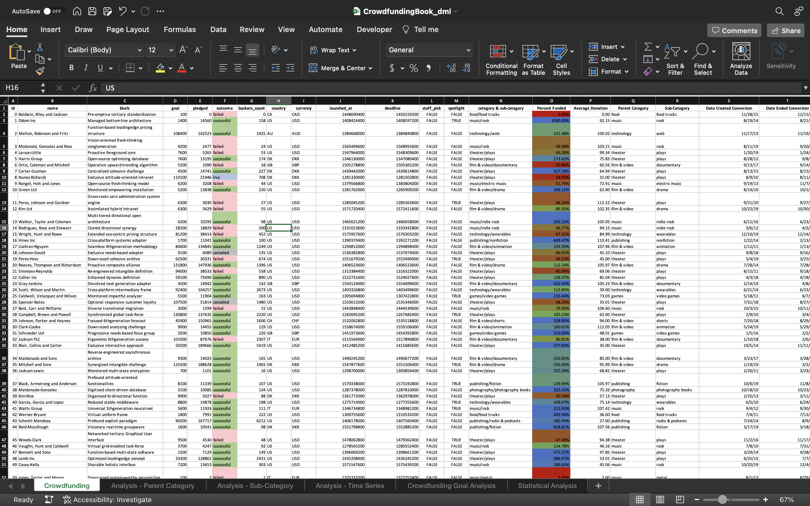

# crowdfunding-data-analysis

## Procedure
- Use conditional formatting to fill each cell in the `outcome` column with a different color, depending on whether the associated campaign was successful, failed, canceled, or is currently live.
    - Create a new column called `Percent Funded` that uses a formula to find how much money a campaign made relative to its initial funding goal.
- Use conditional formatting to fill each cell in the `Percent Funded` column according to a three-color scale. The scale should start at 0 with a dark shade of red, and it should transition to green at 100 and blue at 200.
    - Create a new column called `Average Donation` that uses a formula to find how much each project backer paid on average.
    - Create two new columns, one called `Parent Category` and another called `Sub-Category`, that use formulas to split the `Category and Sub-Category` column into the two new, separate columns.

    

Create a new sheet with a pivot table that analyzes your initial worksheet to count how many campaigns were successful, failed, canceled, or are currently live per category.

Create a stacked-column pivot chart that can be filtered by country based on the table that you created.

Subcategory Stats

Create a new sheet with a pivot table that analyzes your initial sheet to count how many campaigns were successful, failed, or canceled, or are currently live per sub-category.

Create a stacked-column pivot chart that can be filtered by country and parent category based on the table that you created.

The dates in the deadline and launched_at columns use Unix timestamps. Fortunately for us, this formulaLinks to an external site. that can be used to convert these timestamps to a normal date.

Create a new column named Date Created Conversion that will use this formulaLinks to an external site. to convert the data contained in launched_at into Excel's date format.

Create a new column named Date Ended Conversion that will use this formulaLinks to an external site. to convert the data contained in deadline into Excel's date format.

Outcomes Based on Launch Date

Create a new sheet with a pivot table that has a column of outcome, rows of Date Created Conversion, values based on the count of outcome, and filters based on parent category and Years.

Now, create a pivot-chart line graph that visualizes this new table.

Create a report in Microsoft Word, and answer the following questions:

Given the provided data, what are three conclusions that we can draw about crowdfunding campaigns?

What are some limitations of this dataset?

What are some other possible tables and/or graphs that we could create, and what additional value would they provide?

## Crowdfunding Goal Analysis
Create a new sheet with 8 columns:

Goal

Number Successful

Number Failed

Number Canceled

Total Projects

Percentage Successful

Percentage Failed

Percentage Canceled

In the `Goal` column, create 12 rows with the following headers:
    - Less than 1000
    - 1000 to 4999
    - 5000 to 9999
    - 10000 to 14999
    - 15000 to 19999
    - 20000 to 24999
    - 25000 to 29999
    - 30000 to 34999
    - 35000 to 39999
    - 40000 to 44999
    - 45000 to 49999
    - Greater than or equal to 50000

    

A table and corresponding graph showing the percentage of projects that are successful, failed, and canceled based on their crowdfunding goal.

Using the `COUNTIFS()` formula, count how many successful, failed, and canceled projects were created with goals within the ranges listed above. Populate the Number Successful, Number Failed, and Number Canceled columns with these data points.

Add up each of the values in the Number Successful, Number Failed, and Number Canceled columns to populate the Total Projects column. Then, using a mathematical formula, find the percentage of projects that were successful, failed, or canceled per goal range.

Create a line chart that graphs the relationship between a goal amount and its chances of success, failure, or cancellation.

## Statistical Analysis
Most people would use the number of campaign backers to assess the success of a crowdfunding campaign. Creating a summary statistics table is one of the most efficient ways that data scientists can characterize quantitative metrics, such as the number of campaign backers.

For gaining an in-depth understanding of campaign backers, evaluate the number of backers of successful and unsuccessful campaigns by creating a summary statistics table.

- Create a new worksheet in your workbook, and create one column for the number of backers of successful campaigns and one column for unsuccessful campaigns.

- Use Excel to evaluate the following values for successful campaigns, and then do the same for unsuccessful campaigns:
    - The mean number of backers
    - The median number of backers
    - The minimum number of backers
    - The maximum number of backers
    - The variance of the number of backers
    - The standard deviation of the number of backers

Use your data to determine whether the mean or the median better summarizes the data.

Use your data to determine if there is more variability with successful or unsuccessful campaigns. Does this make sense? Why or why not?

## Conclusions
Analysis of the crowdfunding data provided leads us to the following conclusions: (1) The proportion of successful to failed to canceled projects does not vary particularly widely across parent categories except for journalism projects, which showed a 100% success rate. This, of course, may be due to the relatively small showing of journalism projects in the data set. Games appear to show the highest failure rate, while technology appears to show the highest success rate next to journalism. It appears that the only parent categories with a success rate less than 50% are food, games and publishing. Interestingly parent categories representing media projects, namely theater, music and film & video are drastically overrepresented in comparison to other parent categories. (2) When considering sub-categories, it seems that science fiction films and mobile games have by far the highest failure rates, with the only other sub-categories showing success rates less than 50% are video games and food trucks. (3) There appears to be a fairly consistent month-to-month success-to-failure ratio when considering time series data, with a clear spike in successes at the end of calendar year Q2 / beginning of calendar year Q3, which may indicate a seasonal trend of increased cash flow for investors corresponding with that spike.

## Limitations and Additional Direction
The primary limitation of this dataset is that it is unclear where these data originated. For a true comparison of categories and sub-categories across regions and over time, we would need to source reliable data from a well diversified sampling of crowdfunding platforms. Without knowing variations in investor demographics and platform mechanics, it is impossible to draw generalizable conclusions from these data.

In the context of the summaries presented in the accompanying Excel workbook, it would be prudent to conduct further graphical analysis. The present discussion relied upon stacked-to-100 bar charts to compare proportional success and failure rates across categories, which is immeasurably more useful than the visualizations shown by default. Furthermore, the present study did not consider geographical trends because it would have required a much more robust analysis, likely with map-based visualizations in order to draw useful conclusions. Additionally, the seasonality trends discussed above should be further explored by visualizing not only aggregated month-over-month data, but rather by considering such trends over a number of years in which the crowdfunding platform has seen similar volumes of activity.

## Statistical Analysis
The summary statistics table presented in the accompanying Excel workbook indicates that backer counts for both successful and failed campaigns are heavily right-skewed, with successful campaigns showing a greater number of projects that acquire large numbers of investors, which pulls its mean backer count farther to the right of its median backer count than we see for failed campaigns. In general, the media is a better measure of central tendency for skewed data, because it presents a more accurate picture of where the bulk of the population falls, without being overly influenced by extreme outliers. The higher variability seen in successful campaigns, as suggested above, is to be expected because of the attention that projects widely considered to be a good idea can achieve through viral word of mouth and social media mechanisms. Therefore, it is not surprising that more successful campaigns have huge numbers of backers in comparison to failed campaigns.
